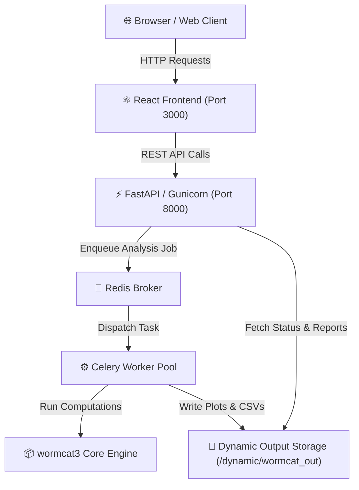

# WormCat 3 Web 🪱📊

[](https://www.python.org/)
[](https://fastapi.tiangolo.com/)
[](https://reactjs.org/)
[](https://github.com/astral-sh/uv)
[](https://www.gnu.org/software/make/)

> **WormCat 3 Web** is a high-performance web platform and REST API suite designed for *C. elegans* genomics research. It provides interactive, asynchronous gene set enrichment analysis (RGS), Gene Set Enrichment Analysis (GSEA), and batch analysis powered by the core `wormcat3` annotation engine.

---

## 🌟 Key Features

- **Single Gene Set Enrichment (RGS)**: Identify enriched functional categories, physiological processes, and cellular locations from gene lists.
- **Ranked Gene Set Enrichment Analysis (GSEA)**: Compute enrichment scores across continuously ranked expression data.
- **Batch Processing**: Run multi-sample analysis jobs in parallel via background worker queues.
- **Interactive Visualizations**: View generated category plots (SVG/PNG) and export tab-separated enrichment metrics.
- **Asynchronous Task Queue**: Powered by **Celery** and **Redis** for non-blocking analysis execution.
- **Modern Developer Tooling**: Built with **Python 3.13**, **FastAPI**, **React**, **Tailwind CSS**, and **`uv`**.

---

## 🏗️ System Architecture



### Technical Stack

| Layer | Technology | Description |
| :--- | :--- | :--- |
| **Backend API** | FastAPI, Gunicorn, Pydantic v2 | High-throughput async REST endpoints |
| **Task Queue** | Celery, Redis | Distributed task processing for heavy statistical workloads |
| **Analysis Engine** | Python 3.13, `wormcat3`, plotnine, pandas | Core enrichment math & plot generation |
| **Frontend** | React 18, Tailwind CSS | Responsive UI for submission & report rendering |
| **Environment** | `uv`, Virtualenv (`.venv`) | Ultra-fast dependency resolution & hermetic environments |
| **Automation** | GNU Make, Bash (`sys_ctrl.sh`) | Unified process orchestration |

---

## 📂 Project Structure

```text
wormcat3-web/
├── backend/
│   ├── app/
│   │   ├── main.py              # FastAPI application entrypoint & middleware
│   │   ├── routers/             # API routes (enrichment, batch, gsea)
│   │   ├── schemas/             # Pydantic data validation schemas
│   │   ├── tasks/               # Celery async tasks & email notification handlers
│   │   └── utils/               # File operations & system helpers
│   ├── celery_worker.py         # Celery application initialization
│   ├── run_api.sh               # FastAPI / Gunicorn launcher script
│   ├── run_celery.sh            # Celery worker launcher script
│   └── test/                    # Backend pytest suite
├── frontend/
│   ├── src/
│   │   ├── components/          # React UI forms, header/footer, report viewers
│   │   ├── api/                 # Frontend REST API client services
│   │   └── hooks/               # Custom React hooks
│   ├── run_react.sh             # React dev/prod runner script
│   └── package.json             # NPM dependencies & scripts
├── scripts/
│   ├── run_utils.sh             # Environment detection & .venv auto-activation
│   └── sys_utils.sh             # Process management & log rotation helpers
├── Makefile                     # Standard developer build targets
├── pyproject.toml               # Python package metadata & dependencies (uv)
├── sys_ctrl.sh                  # Main control script for all services
└── README.md                    # Project documentation
```

---

## 🚀 Quickstart & Installation

### Prerequisites

- **Python**: 3.13+
- **Node.js**: 18+ (with `npm`)
- **`uv`**: Installed (`brew install uv` or `curl -LsSf https://astral.sh/uv/install.sh | sh`)
- **Redis**: Installed locally or accessible via configuration

### 1. Installation

Bootstrap the Python `.venv` environment and install all backend and core package dependencies:

```bash
make install
```

Install frontend Node dependencies:

```bash
cd frontend && npm install && cd ..
```

### 2. Service Management (`make`)

The project uses a unified `Makefile` to control development servers, test suites, and process monitoring:

| Command | Description |
| :--- | :--- |
| `make install` | Create `.venv` and install Python dependencies via `uv` |
| `make dev` | Launch Redis, Celery, FastAPI, and ReactJS services concurrently |
| `make status` | Display process IDs and health status of all running services |
| `make stop` | Stop all background processes gracefully |
| `make test` | Execute the backend `pytest` test suite |
| `make lint` | Run code quality checks (`ruff`) |
| `make clean` | Remove temporary cache directories and build artifacts |

---

## 💡 Usage Guide

### Starting the Development Environment

Run the following command in the project root:

```bash
make dev
```

This launches:
- **Redis Server**: `localhost:6379`
- **FastAPI Backend**: `http://localhost:8000` (Interactive API docs at `http://localhost:8000/docs`)
- **Celery Worker**: Background job executor
- **React Frontend**: `http://localhost:3000`

### Performing an Enrichment Analysis

1. Navigate to `http://localhost:3000` in your browser.
2. Choose your analysis mode:
   - **Enrichment (RGS)**: Input a set of WormBase Gene IDs (e.g., `WBGene00016360`).
   - **GSEA**: Upload a ranked list of genes with numeric metrics.
   - **Batch**: Upload a multi-sample CSV file.
3. Submit the job. The application generates a unique `run_id` and queues the execution.
4. View real-time progress and download generated category charts (SVG) and summary tables (CSV/Excel).

---

## 🧪 Testing & Verification

Run backend unit and integration tests using `uv`:

```bash
make test
```

To test specific API endpoint routers:

```bash
uv run --python .venv pytest backend/test/routers/test_enrichment.py
```

To run frontend API tests:

```bash
cd frontend && npx ava src/test/api/enrichmentAPI.test.mjs
```

---

## 📜 License & Citation

If you use **WormCat 3 Web** in your research, please cite:
> *WormCat: An Open-Source Tool for C. elegans Genomic Data Analysis.*

---

## 🤝 Contributing

Contributions, bug reports, and feature requests are welcome!
1. Fork the repository.
2. Create a feature branch (`git checkout -b feature/amazing-feature`).
3. Ensure code passes linting (`make lint`) and tests (`make test`).
4. Commit your changes.
