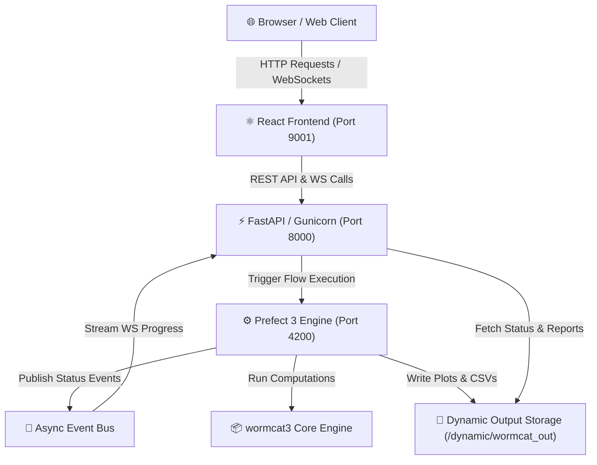

# WormCat 3 Web 🪱📊

[](https://www.python.org/)
[](https://fastapi.tiangolo.com/)
[](https://www.prefect.io/)
[](https://reactjs.org/)
[](https://github.com/astral-sh/uv)
[](https://www.gnu.org/software/make/)

> **WormCat 3 Web** is a high-performance web platform and REST API suite designed for *C. elegans* genomics research. It provides interactive, asynchronous gene set enrichment analysis (RGS), Ranked Gene Set Enrichment Analysis (GSEA), and batch analysis powered by Prefect 3 workflows and the core `wormcat3` annotation engine.

---

## 🌟 Key Features

- **Single Gene Set Enrichment (RGS)**: Identify enriched functional categories, physiological processes, and cellular locations from gene lists.
- **Ranked Gene Set Enrichment Analysis (GSEA)**: Compute enrichment scores across continuously ranked expression data.
- **Batch Processing**: Run multi-sample analysis jobs in parallel via background Prefect flows.
- **Interactive Visualizations**: View generated category plots (SVG/PNG) and export tab-separated enrichment metrics.
- **Asynchronous Task Orchestration**: Powered by **Prefect 3** for non-blocking flow execution and real-time progress streaming over WebSockets.
- **Modern Developer Tooling**: Built with **Python 3.13**, **FastAPI**, **React**, **Tailwind CSS**, and **`uv`**.

---

## 🏗️ System Architecture



### Technical Stack

| Layer | Technology | Description |
| :--- | :--- | :--- |
| **Backend API** | FastAPI, Gunicorn, Pydantic v2 | High-throughput async REST endpoints & WebSockets |
| **Task Queue** | Prefect 3 | Workflow orchestration & flow state management |
| **Analysis Engine** | Python 3.13, `wormcat3`, plotnine, pandas | Core enrichment math & plot generation |
| **Frontend** | React 18, Tailwind CSS | Responsive UI for submission & report rendering |
| **Environment** | `uv`, Virtualenv (`.venv`) | Ultra-fast dependency resolution & hermetic environments |
| **Automation** | GNU Make, Bash ([sys_ctrl.sh](file:///Users/dan/Code/Python/wormcat3-web/sys_ctrl.sh)) | Unified process orchestration |

---

## 📂 Project Structure

```text
wormcat3-web/
├── backend/
│   ├── app/
│   │   ├── main.py              # FastAPI application entrypoint & middleware
│   │   ├── flows/               # Prefect workflow definitions (enrichment, batch, gsea)
│   │   ├── tasks/               # Prefect atomic task functions
│   │   ├── services/            # AsyncEventBus, ProgressPublisher & analysis services
│   │   ├── routers/             # API routes (enrichment, batch, gsea)
│   │   ├── schemas/             # Pydantic data validation & progress models
│   │   └── utils/               # File operations, logging & SMTP helpers
│   ├── env.dev                  # Backend development environment template
│   ├── env.prod                 # Backend production environment template
│   ├── run_api.sh               # FastAPI / Gunicorn launcher script
│   ├── run_prefect.sh           # Prefect service launcher script
│   ├── sys_api.sh               # FastAPI process manager
│   ├── sys_prefect.sh           # Prefect server process manager
│   └── test/                    # Backend pytest suite
├── frontend/
│   ├── src/
│   │   ├── components/          # React UI forms, header/footer, report viewers
│   │   ├── api/                 # Frontend REST API client services (Axios)
│   │   └── hooks/               # Custom React hooks (WebSockets, processors)
│   ├── env.dev                  # Frontend development environment template
│   ├── env.prod                 # Frontend production environment template
│   ├── run_react.sh             # React dev/prod runner script
│   ├── server.js                # Express static server for production builds
│   ├── sys_react.sh             # React process manager
│   └── package.json             # NPM dependencies & scripts
├── scripts/
│   ├── run_utils.sh             # Environment detection & .venv auto-activation
│   └── sys_utils.sh             # Process management & log rotation helpers
├── Makefile                     # Developer build targets & workflow orchestration
├── pyproject.toml               # Python package metadata & dependencies (uv)
├── sys_ctrl.sh                  # Main control script for all services
└── README.md                    # Project documentation
```

---

## ⚙️ Environment Configuration (`.env`)

Both backend and frontend services require their own `.env` configuration file in their respective subdirectories ([backend/.env](file:///Users/dan/Code/Python/wormcat3-web/backend/.env) and [frontend/.env](file:///Users/dan/Code/Python/wormcat3-web/frontend/.env)). Environment templates are provided for development (`env.dev`) and production (`env.prod`).

### Initial Setup

Copy the appropriate template to `.env` in both `backend` and `frontend`:

#### For Development:
```bash
cp backend/env.dev backend/.env
cp frontend/env.dev frontend/.env
```

#### For Production:
```bash
cp backend/env.prod backend/.env
cp frontend/env.prod frontend/.env
```

---

### Backend Environment Variables ([backend/.env](file:///Users/dan/Code/Python/wormcat3-web/backend/.env))

Sample `.env` file for the backend:

```ini
# Frontend Origin URL allowed by FastAPI CORS middleware
REACT_APP_URL=http://localhost:9001

# SMTP Email Notification Settings
SMTP_SERVER=smtp.gmail.com
SMTP_LOGIN=wormcat.emailer@gmail.com
SMTP_PASSWD=your_app_password_here

# Logging verbosity (DEBUG, INFO, WARNING, ERROR, OFF)
WORMCAT_LOG_LEVEL=DEBUG

# Destination directory for generated plots, CSVs, and zip archives
# Development (served by React public dir):
WORMCAT_OUT_PATH=../frontend/public/dynamic/wormcat_out
# Production (served by React build dir):
# WORMCAT_OUT_PATH=../frontend/build/dynamic/wormcat_out
```

#### Variable Breakdown:

| Variable | Type | Default / Example | Description |
| :--- | :--- | :--- | :--- |
| `REACT_APP_URL` | String (URL) | `http://localhost:9001` (dev)<br>`https://researcher.danhiggins.org` (prod) | Frontend application origin URL. Configured in FastAPI [main.py](file:///Users/dan/Code/Python/wormcat3-web/backend/app/main.py) `CORSMiddleware` (`allow_origins`) to allow cross-origin browser requests. |
| `WORMCAT_OUT_PATH` | String (Path) | `../frontend/public/dynamic/wormcat_out` (dev)<br>`../frontend/build/dynamic/wormcat_out` (prod) | Relative or absolute path where flow execution outputs (SVG charts, CSV exports, Excel files, and zipped packages) are saved. |
| `WORMCAT_LOG_LEVEL` | String | `DEBUG` (dev)<br>`WARNING` (prod) | Minimum logging level for backend modules (`DEBUG`, `INFO`, `WARNING`, `ERROR`, or `OFF` to silence). |
| `WORMCAT_LOG_PATH` | String (Path) | `${HOME}/var/log/wormcat3.log` *(optional)* | Optional path override for backend file logging. If unset, log output is handled standardly by [logger.py](file:///Users/dan/Code/Python/wormcat3-web/backend/app/utils/logger.py) and [sys_api.sh](file:///Users/dan/Code/Python/wormcat3-web/backend/sys_api.sh). |
| `ACTIVATE_DEBUG` | String (Boolean) | `FALSE` *(optional)* | When set to `TRUE`, launches FastAPI with live reload and attaches the `debugpy` remote debugger listening on `0.0.0.0:58979`. |
| `SMTP_SERVER` | String (Host) | `smtp.gmail.com` | Hostname of the outgoing SMTP email server. |
| `SMTP_LOGIN` | String (Email) | `wormcat.emailer@gmail.com` | Username / email address used to authenticate with the SMTP server. |
| `SMTP_PASSWD` | String | `""` | App-specific password or authentication credential for the SMTP service. If left empty, email sending is skipped with a warning log. |

---

### Frontend Environment Variables ([frontend/.env](file:///Users/dan/Code/Python/wormcat3-web/frontend/.env))

Sample `.env` file for the frontend:

```ini
# Base URL for FastAPI REST API endpoints
REACT_APP_FASTAPI_BASE_URL=http://localhost:8000

# Base WebSocket URL for real-time job progress streaming
REACT_APP_FASTAPI_BASE_WS=ws://localhost:8000

# Axios HTTP request timeout in milliseconds
REACT_APP_FASTAPI_TIMEOUT_MS=45000

# Port for React development server and Express production server
PORT=9001
```

#### Variable Breakdown:

| Variable | Type | Default / Example | Description |
| :--- | :--- | :--- | :--- |
| `REACT_APP_FASTAPI_BASE_URL` | String (URL) | `http://localhost:8000` | Base HTTP endpoint for the FastAPI backend used by the Axios client ([apiRequestUtil.js](file:///Users/dan/Code/Python/wormcat3-web/frontend/src/api/apiRequestUtil.js)) for job submissions and metadata queries. |
| `REACT_APP_FASTAPI_BASE_WS` | String (URL) | `ws://localhost:8000` | Base WebSocket endpoint used by [useTaskWebSocket.js](file:///Users/dan/Code/Python/wormcat3-web/frontend/src/hooks/useTaskWebSocket.js) for live flow status and progress bar updates. |
| `REACT_APP_FASTAPI_TIMEOUT_MS` | Integer (ms) | `45000` | Request timeout duration in milliseconds for REST API calls. |
| `PORT` | Integer | `9001` | Port number on which the React development server (via Craco/Webpack) and the production Express server ([server.js](file:///Users/dan/Code/Python/wormcat3-web/frontend/server.js)) listen. |

---

## 🚀 Quickstart & Installation

### Prerequisites

- **Python**: 3.13+
- **Node.js**: 18+ (with `npm`)
- **`uv`**: Installed (`curl -LsSf https://astral.sh/uv/install.sh | sh` or `brew install uv`)

### 1. Installation

Bootstrap the Python `.venv` environment via `uv` (installs `wormcat3-web` in editable mode, links local `../wormcat3` if present or fetches published package), and installs frontend npm packages:

```bash
make install
```

### 2. Configure Environment Files

Create the local `.env` files from templates:

```bash
cp backend/env.dev backend/.env
cp frontend/env.dev frontend/.env
```

### 3. Service Management via `Makefile`

All process lifecycles, static asset builds, testing, and linting are driven through the local [Makefile](file:///Users/dan/Code/Python/wormcat3-web/Makefile):

| Command | Description |
| :--- | :--- |
| `make help` | Display available make targets and descriptions |
| `make install` | Create `.venv` (Python 3.13) and install all backend and frontend dependencies via `uv` & `npm` |
| `make build` | Build optimized frontend production static assets into `frontend/build` |
| `make start-dev` | Start all development services (Prefect Server, FastAPI, React Dev server) |
| `make start-prod` | Build frontend assets and start production services (Prefect Server, FastAPI, React Express server) |
| `make stop` | Gracefully terminate all running background services and processes |
| `make status` | Display process IDs (PIDs) and health status of all running services |
| `make test` | Execute the backend `pytest` test suite using `uv run` |
| `make lint` | Run static analysis and code quality checks using `ruff` |
| `make clean` | Remove build artifacts (`frontend/build`), caches (`.pytest_cache`, `.uv`, `.ruff_cache`), and `__pycache__` |

---

## 💡 Usage Guide

### Starting the Development Environment

Launch all background services in development mode:

```bash
make start-dev
```

This starts:
- **React Frontend (Dev)**: `http://localhost:9001` (hot-reloading enabled)
- **FastAPI Backend**: `http://localhost:8000` (Interactive Swagger docs at `http://localhost:8000/docs`)
- **Prefect Server**: `http://localhost:4200`

### Starting the Production Environment

To build static frontend bundles and serve via the Express production server:

```bash
make start-prod
```

### Checking Status & Stopping Services

```bash
# Check service health and PIDs
make status

# Stop all running services
make stop
```

### Performing an Enrichment Analysis

1. Navigate to `http://localhost:9001` in your browser.
2. Choose your analysis mode:
   - **Enrichment (RGS)**: Input a set of WormBase Gene IDs (e.g., `WBGene00016360`) or gene symbols.
   - **GSEA**: Upload a ranked list of genes with numeric metrics.
   - **Batch**: Upload a multi-sample CSV dataset.
3. Submit the job. The application generates a unique `run_id` and queues flow execution in Prefect.
4. Monitor real-time progress streamed over WebSockets and view/download generated category plots (SVG) and summary tables (CSV/Excel).

### Monitoring Prefect Workflows (Dashboard UI)

When services are running (`make start-dev` or `make start-prod`), the Prefect 3 Workflow Dashboard is automatically hosted locally:

- **Dashboard URL**: `http://localhost:4200` (or `http://127.0.0.1:4200`)

#### What You Can Monitor in the Prefect UI:
- **Flow Runs**: View live, completed, and failed executions for all enrichment analysis flows (`enrichment_flow`, `batch_flow`, `gsea_flow`).
- **Task Graphs & Execution Timelines**: Inspect individual task execution steps, dependencies, parameters, and run durations.
- **Real-Time Logs**: Review captured standard output, debug messages, and tracebacks for each atomic task.
- **Flow State & Concurrency**: Track queued, running, and retried states across background workers.

---

## 🧪 Testing & Verification

Run backend unit and integration tests using `uv`:

```bash
make test
```

To test specific API endpoint routers:

```bash
uv run --python .venv pytest backend/test/routers/test_enrichment.py
```

To run frontend API integration tests:

```bash
cd frontend && npx ava src/test/api/enrichmentAPI.test.mjs
```

---

## 📜 License & Citation

If you use **WormCat 3 Web** in your research, please cite:
> *WormCat: An Open-Source Tool for C. elegans Genomic Data Analysis.*

---

## 🤝 Contributing

1. Ensure all code conforms to project standards and passes linting:
   ```bash
   make lint
   ```
2. Ensure all tests pass:
   ```bash
   make test
   ```
3. Commit changes and submit a pull request.

